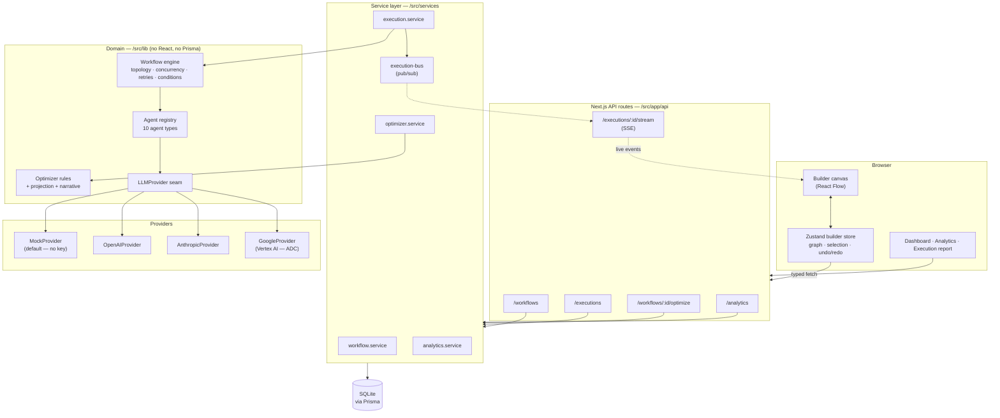

# AgentOps Studio

**Build, Execute & Optimize AI Agent Systems**

A visual engineering platform for multi-agent workflows. Compose agents on a canvas, execute the graph against a real task, inspect every prompt and response the run produced, and let an optimizer tell you where the graph is wasting time and money.

It is not a chatbot. It is the tool you would reach for when an agent pipeline is slow, expensive, or wrong, and you need to know which node is responsible.

**It runs with no API keys.** The default provider is a deterministic mock that produces realistic, agent-specific output, so `npm run dev` gives you a working system on a fresh clone.

---

## Quick start

```bash
npm install
npx prisma migrate dev     # creates prisma/dev.db and applies the schema
npm run db:seed            # 3 example workflows + real executions to populate the dashboard
npm run dev                # http://localhost:3000
```

Requires Node.js ≥ 20.11. No `.env` file is needed — every setting has a working default. Copy `.env.example` to `.env` only when you want to change something.

`npm run setup` runs migrate + generate + seed in one step.

---

## What's in it

| Page | What it does |
|---|---|
| **Dashboard** | Workflow count, execution count, average latency, total cost; recent runs and recently touched workflows. |
| **Workflows** | Search, tag-filter, favorite, duplicate, import/export as JSON. |
| **Builder** | React Flow canvas — drag agents in, connect them, set per-node overrides, add branch conditions, undo/redo, save with automatic versioning. |
| **Run panel** | Type a task, execute the graph, and watch each node report status, duration, cost, and confidence live over SSE. |
| **Optimizer** | Scores the graph out of 100, explains what's wrong and why, projects the latency and cost saving, and applies the fixes to the canvas as an undoable edit. |
| **Execution report** | Every step's exact system prompt, rendered user prompt, response, token usage, retries, and skip reasons — plus a wall-clock timeline where parallel steps visibly overlap. |
| **Analytics** | Latency and cost per agent, activity over time, run-outcome breakdown, with a table view of every chart. |

Press <kbd>⌘K</kbd> / <kbd>Ctrl K</kbd> anywhere for the command palette.

---

## Architecture



### The three seams that matter

**`LLMProvider`** — one interface, four implementations. Swapping providers is a registry lookup, and a node that asks for a provider with no credentials transparently falls back to the mock. That is the rule that keeps the project runnable with an empty `.env`. Adding Vertex AI touched exactly three things: a new class, one registry line, one enum entry — no call site changed, because `PROVIDER_IDS` already drives the Zod schemas and the builder's provider dropdown.

**`WorkflowGraph`** — the canvas, the engine, the optimizer, and the database all speak this one structure. None of them import each other. The React Flow view models live in `src/components/builder/flow-types.ts` and are derived from the domain graph, never persisted.

**The engine is UI-independent.** `src/lib/workflow/` has no React and no Prisma imports. It takes a graph and a task, and emits an event stream. That is why the same engine drives a live browser run and the seed script.

### Layout

```
src/
├── app/                    # Next.js App Router — pages + API routes
│   ├── api/                # 15 route handlers, all returning one envelope
│   ├── workflows/[id]/     # the builder
│   └── executions/[id]/    # the run report
├── components/
│   ├── ui/                 # shadcn-style primitives over Radix
│   ├── builder/            # canvas, palette, inspector, optimizer, run panel
│   ├── executions/         # timeline, step cards, run table
│   ├── analytics/          # Recharts views + table twins
│   └── layout/             # shell, sidebar, command palette
├── hooks/                  # data fetching, SSE, hotkeys
├── stores/                 # Zustand builder store (undo/redo)
├── services/               # persistence + orchestration
├── lib/
│   ├── agents/             # the agent taxonomy and its implementations
│   ├── workflow/           # the execution engine
│   ├── optimizer/          # rules, projection, narrative
│   └── providers/          # the LLMProvider seam
└── types/                  # Zod schemas — the contracts every layer shares
```

Business logic does not live in components. The rule is enforceable: `src/lib/` imports nothing from `src/components/`.

---

## The agents

Ten reusable types, each with a real system prompt, a temperature, a token ceiling, and a cost/latency estimate the optimizer uses to project a run *before* executing it.

| Agent | Role |
|---|---|
| **Planner** | Decomposes a task into subtasks with owners, dependencies, and "done when" conditions. |
| **Researcher** | Produces findings with confidence scores — and always states the evidence gaps. |
| **Retriever** | Ranked passages from the index, with relevance scores. No interpretation. |
| **Knowledge** | Entities, relationships, and canonical definitions; surfaces source conflicts. |
| **Coder** | The implementation, plus an explicit list of what it deliberately did not do. |
| **Reviewer** | Findings split into blocking and non-blocking, ending in a verdict. |
| **Critic** | Adversarial evaluation of the reasoning, scored out of 10. |
| **Tester** | A coverage matrix and runnable tests — reports real failures. |
| **Legal Validator** | Clause-by-clause risk ratings and proposed redlines. |
| **Custom** | Blank agent; set its system prompt on the node. |

Any node can override its type's prompt, temperature, token limit, provider, or retry count.

---

## Execution engine

- **Topological layering** — nodes in the same layer run concurrently, bounded by `ENGINE_MAX_CONCURRENCY`.
- **Branching** — an edge can carry a predicate over the source node's result (`confidence ≥ 0.7`, `status = success`, `output contains …`), evaluated by a small hand-written interpreter, never `eval`.
- **Retries** — per-node attempt limits with backoff; every attempt is recorded.
- **Full telemetry per step** — status, layer, attempts, duration, exact prompts, response, token usage, cost, confidence, errors, skip reasons.
- **Reproducibility** — the graph that actually ran is snapshotted onto the execution row, so a later edit never rewrites history.

### Live updates

The engine emits `run.start`, `step.start`, `step.retry`, `step.skip`, `step.finish`, `run.finish`. `execution-bus` relays them to `/api/executions/:id/stream` as Server-Sent Events, with a replay buffer so a client that subscribes slightly late still sees the whole run.

**Stated limitation:** the bus is an in-process emitter, so this is single-instance only. Two servers behind a load balancer would not see each other's runs. The production shape is a job queue plus Redis pub/sub — the engine already emits a serialisable event stream, so that swap touches `execution-bus.ts` and nothing else.

---

## Optimizer

Deterministic rules over the graph, each returning a declarative patch rather than mutating anything:

- Independent agents left in series that could run in parallel
- Duplicate agents of the same type doing the same work
- Ordering mistakes (a Reviewer placed before the Tester whose output it needs)
- Agents irrelevant to the workflow's domain (a Legal Validator in a pure coding graph)
- Missing quality gates, unreachable nodes, single points of failure

Output: a score out of 100 with a letter grade, per-suggestion reasoning, and projected latency/cost reduction from the critical path. Applying suggestions **rewrites the canvas but does not save** — an optimizer that silently rewrote stored workflows would be an alarming thing to ship.

---

## Database

SQLite via Prisma. The graph is stored decomposed into node and edge rows rather than as one JSON blob, so "how many workflows use a Legal Validator?" is a query rather than a full-table scan.

| Model | Purpose |
|---|---|
| `Workflow` | Name, description, tags, favorite, version counter |
| `WorkflowNode` | One agent on the canvas — type, label, position, config overrides |
| `WorkflowEdge` | A directed dependency, with its branch condition |
| `WorkflowVersion` | Immutable graph snapshot, written whenever structure changes |
| `Execution` | One run — task, status, aggregate metrics, and the graph that ran |
| `ExecutionStep` | One node's record: prompts, response, tokens, cost, confidence, retries |
| `AgentConfiguration` | Editable per-type defaults, seeded from the built-in catalogue |

Version history is append-only: restoring an old version writes a *new* version, so a restore is itself undoable.

---

## API

Every route returns `{ data }` on success or `{ error: { code, message, details? } }` on failure.

| Method | Route | Purpose |
|---|---|---|
| `GET` | `/api/workflows` | List; `?search=` `&tag=` `&favorite=` |
| `POST` | `/api/workflows` | Create |
| `GET` | `/api/workflows/:id` | Full workflow including graph |
| `PATCH` | `/api/workflows/:id` | Update; a graph change cuts a new version |
| `DELETE` | `/api/workflows/:id` | Delete, cascading to runs |
| `POST` | `/api/workflows/:id/duplicate` | Clone |
| `POST` | `/api/workflows/:id/favorite` | Toggle favorite |
| `GET` | `/api/workflows/:id/export` | Portable JSON download |
| `GET` | `/api/workflows/:id/versions` | Snapshot history |
| `POST` | `/api/workflows/:id/versions` | Restore a version |
| `POST` | `/api/workflows/:id/optimize` | Analyse saved graph or `graphOverride` |
| `POST` | `/api/workflows/:id/optimize/apply` | Return the patched graph (does not persist) |
| `GET` | `/api/workflows/tags` | Tags in use, with counts |
| `POST` | `/api/documents/extract` | Multipart PDF upload; returns extracted text |
| `GET` | `/api/executions` | Run history; `?workflowId=` `&status=` |
| `POST` | `/api/executions` | Start a run; returns immediately with a stream URL |
| `GET` | `/api/executions/:id` | Full run including every step |
| `DELETE` | `/api/executions/:id` | Delete a run |
| `GET` | `/api/executions/:id/stream` | Live SSE event stream |
| `GET` | `/api/analytics` | Overview, per-agent stats, timeline, recent runs |
| `GET` | `/api/agents` | Agent catalogue + provider availability |
| `GET` | `/api/health` | DB reachability and the active provider |

Start a run:

```bash
curl -X POST localhost:3000/api/executions \
  -H 'Content-Type: application/json' \
  -d '{"workflowId":"<id>","task":"Review a software licensing agreement and identify legal risks."}'
```

---

## Using real providers

Leave the credentials unset and everything runs on `MockProvider`. Supply them and the matching provider becomes available; any node configured to use it will hit the real API, and nodes still fall back to the mock when their requested provider has no credentials.

```bash
ANTHROPIC_API_KEY="sk-ant-..."
ANTHROPIC_DEFAULT_MODEL="claude-opus-5"   # the default

OPENAI_API_KEY="sk-..."
OPENAI_DEFAULT_MODEL="gpt-4o-mini"

GOOGLE_CLOUD_PROJECT="my-project"         # no key — see below
GOOGLE_CLOUD_LOCATION="us-central1"
GOOGLE_DEFAULT_MODEL="gemini-3.6-flash"

DEFAULT_LLM_PROVIDER="anthropic"          # none | mock | openai | anthropic | google
```

`none` is an explicit opt-out: everything runs on the mock even when real credentials are present.

Resolution order for any node is **node override → agent-type pin → `DEFAULT_LLM_PROVIDER`**. Built-in agents pin nothing, so the env setting is what actually governs a run; a node that names a provider with no credentials still falls back to the mock rather than failing.

### Google Vertex AI

Vertex has no API key. It authenticates with **Application Default Credentials**, so pick whichever fits:

```bash
gcloud auth application-default login              # local development
GOOGLE_APPLICATION_CREDENTIALS="/path/key.json"    # service account
# ...or nothing on GCP, where the metadata server provides them
```

Because credentials are ambient rather than a value we can inspect, `GOOGLE_CLOUD_PROJECT` is what marks the provider as configured — `isAvailable()` reports "configured", not "credentials verified". If ADC turns out to be missing, the first call fails with a **non-retryable** error naming the fix rather than burning all three retry attempts on a misconfiguration.

Only the token minting uses a library (`google-auth-library`); the `generateContent` call itself is a plain `fetch`, which keeps `AbortSignal` cancellation working and leaves retry policy entirely to the engine.

The sidebar always shows which provider is actually serving requests, so "am I spending money right now?" is answerable at a glance.

Engine and mock tuning (`ENGINE_MAX_CONCURRENCY`, `ENGINE_MAX_ATTEMPTS`, `MOCK_LATENCY_FACTOR`, `MOCK_FAILURE_RATE`, …) are documented in `.env.example`.

---

## Scripts

| Command | What it does |
|---|---|
| `npm run dev` | Development server |
| `npm run build` | Production build (runs `prisma generate` first) |
| `npm run typecheck` | `tsc --noEmit` |
| `npm run lint` | ESLint |
| `npm run format` | Prettier |
| `npm test` | Vitest |
| `npm run test:coverage` | Coverage report |
| `npm run db:migrate` | Create and apply a migration |
| `npm run db:seed` | Seed 3 workflows and run real executions |
| `npm run db:studio` | Prisma Studio |
| `npm run db:reset` | Drop and rebuild the database |

---

## Design notes

**Dark-first, both themes real.** Colours are HSL triplet CSS variables, so a theme swap touches no component. Light mode is a complete theme, not an afterthought.

**Charts are validated, not eyeballed.** The categorical palette clears colourblind-separation, lightness-band, chroma, and contrast checks against both surfaces. Single-measure charts use one colour — shading bars by their own value would double-encode length as hue. There is no dual-axis chart anywhere: runs, latency, cost, and tokens differ by orders of magnitude, and overlaying them on two y-scales would invent a correlation the data doesn't contain. Every chart has a table view.

**Fonts are CSS stacks, not `next/font/google`,** so the project builds with no network access.

**Undo/redo snapshots whole graphs.** Graphs here are tens of nodes; snapshotting is cheaper and far less bug-prone than inverse patches. Dragging is excluded from history — it fires per frame and would otherwise consume the entire stack — so the canvas snapshots once on drag start.

---

## Tests

```bash
npm test
npm run test:coverage
```

**509 tests across 25 files.** Coverage on the domain layer: `lib/workflow` 96%, `lib/optimizer` 92%.

| Area | What's covered |
|---|---|
| **Engine** | Topological layering, cycle detection, graph validation, branch-condition evaluation, bounded concurrency, backoff jitter, metrics. |
| **Executor** | Data flow between nodes, parallel dispatch, OR-join activation, subtree pruning on an unsatisfied branch, retry/no-retry classification, per-node attempt caps, failure isolation, cancellation, unreachable-node handling. |
| **Optimizer** | Every rule gets a graph that violates it *and* one that doesn't — a rule that fires on everything is as useless as one that never fires. Plus scoring, grading, patch safety, and selective apply. |
| **Providers** | Mock determinism and seed variation, `maxTokens` truncation, simulated-failure retryability, credential-based fallback, `none` opt-out, provider inheritance from the env default, pricing and token math. |
| **Agents** | Definition integrity, override merging, prompt assembly, and confidence never exceeding the weakest upstream input. |
| **Services** | SSE bus replay and terminal-event semantics, error mapping, JSON-column serialisation. |
| **UI** | Builder store (undo/redo, dangling-edge cleanup, drag exclusion), API client envelope and typed errors, SSE hook, execution table and step cards. |

The engine tests inject a frozen clock, a no-op sleep, and stub agents, so they assert orchestration rather than model behaviour and the suite runs in ~12s.

---

## Known limitations

- **Single-instance SSE.** See the execution-engine note above.
- **No authentication.** Everything is single-tenant and unauthenticated; this is a local engineering tool, not a hosted product.
- **SQLite.** Fine for local use; the schema moves to Postgres with a datasource change and a `TEXT` → `jsonb` swap on the JSON columns.
- **The service layer is not unit-tested.** `workflow.service`, `execution.service`, and `analytics.service` all talk to Prisma, so testing them properly means a throwaway database per run rather than a mock that would only assert the mock. The pure parts they depend on — the engine, the optimizer, serialisation, the event bus — are covered directly. The API surface is exercised end-to-end instead (see below).
- **The real OpenAI, Anthropic and Google providers are only covered structurally.** Their request-shaping logic is tested through the registry, pricing, and sampling-parameter helpers; the HTTP calls themselves would need recorded fixtures or live credentials.
- **The `gemini-3.6-flash` price row is inherited from the Gemini 2.5 Flash tier and is unverified.** Every cost figure the dashboard and optimizer report for a Google run depends on it — confirm against the Vertex pricing page before trusting those numbers.
- **Attached PDFs are flattened to text, and every node gets the whole document.** Extraction happens once at upload (`POST /api/documents/extract`) so that all four providers see the same thing and the `LLMProvider` interface stays string-based. Two consequences worth knowing: layout is lost, so tables and multi-column pages arrive in reading order rather than as tables; and a scanned PDF with no text layer is rejected rather than silently sent as a blank document — it needs OCR first. Because the text is replayed into *every* node's prompt, input tokens scale with document size × node count, which dominates the cost of a run on a long agreement.
- **Layout is not tested against real-world PDFs.** The extractor is covered with generated PDFs built byte by byte in `pdf-fixture.ts`, which exercises the parse, pagination, whitespace and truncation paths but not the messy ones — rotated pages, embedded fonts with broken encodings, or forms.

### End-to-end check

The unit suite does not touch the database or the HTTP layer, so verify those by running the thing:

```bash
npm run build && npm start

curl localhost:3000/api/health                       # db reachable, active provider
curl localhost:3000/api/workflows                    # seeded workflows
curl -N localhost:3000/api/executions/<id>/stream    # live SSE frames
```
